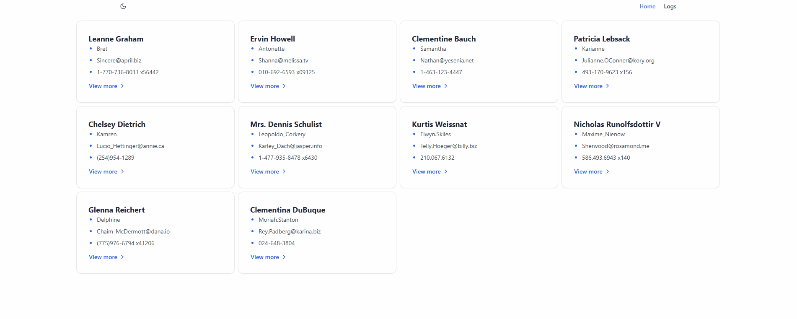

# Frontend
Esta aplicación está hecha con React, TypeScript y Tailwind para los estilos. La aplicación consta de cuatro componentes principales: usuarios, fotos, publicaciones y registros de peticiones.

## Tecnologias usadas:
- React
- React Router
- TypeScript
- Tailwind

## Requisitos
- Node 18 or higher

## Instalación
Instalar dependencias:
```bash
yarn add
```
Iniciar el servidor de desarrollo:
```bash
yarn dev
```

## Endpoints
**Las urls de la página son:**
- http://localhost:5173/ muestra todos los usuarios.
- http://localhost:5173/user/1 muestra las fotos del usuario y las publicaciones de este.
- http://localhost:5173/logs muestra todos los logs del sistema.
